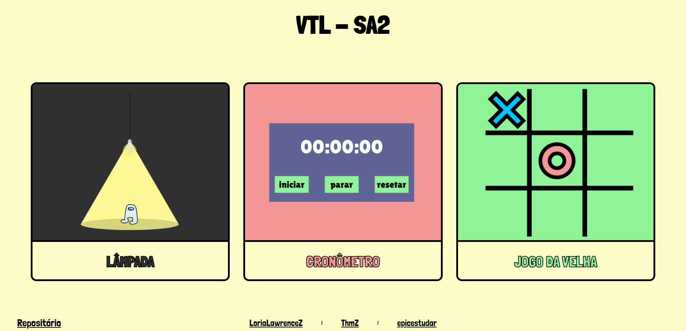
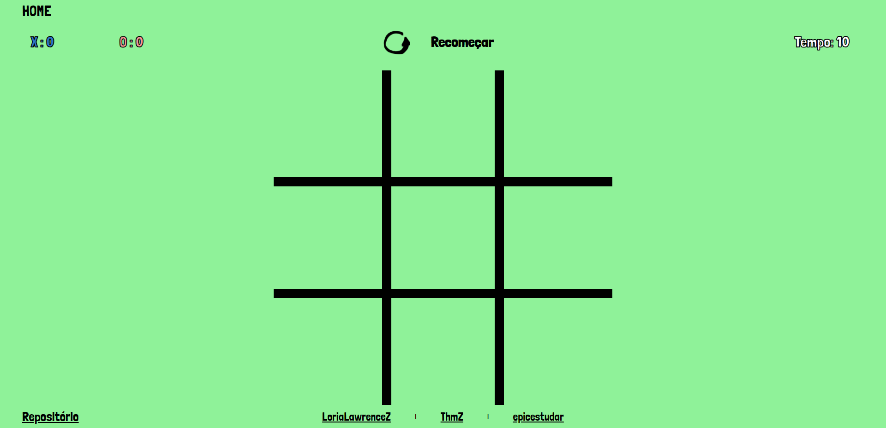

<h1 align="center"> VTL-SA2 </h1>

 Web Aplicação com funcionalidades JavaScript 

<h2 align="center">
  
  
  
</h2>

<h2 id="index"> 📌 Índice </h2>

   
  <a href="#index"> Índice </a>       |        
  <a href="#nome-do-projeto"> Nome do Projeto </a>       |              
  <a href="#descricao"> Descrição e motivação </a>       |             
  <a href="#badges"> Badges </a>       |            
  <a href="#visuais-e-telas"> Visuais e Telas </a>       |            
  <a href="#tecnologias">Tecnologias </a>       |           
  <a href="#uso"> Uso </a>       |            
  <a href="#status-do-projeto"> Status do projeto </a>       |              
  <a href="#issues"> Issues </a>        |        
  <a href="#contribuicoes"> Contribuições </a>       |            
  <a href="#autores-e-agradecimentos"> Autores e Agradecimentos </a>        |        
  <a href="#referencias"> Referências </a>        |        
  <a href="#licenca"> Licença </a>  

<h2 id="nome-do-projeto"> Nome do Projeto </h2>
<h3> VTL-SA2: Vinícius, Lorenzo e Thomaz - Situação de Aprendizagem 2 </h3>

<h2 id="descricao"> Descrição </h2>

 Web Aplicação desenvolvida em HTML5, CSS3 e JavaScript, contendo 4 páginas, uma página índice, que direciona o usuário à 3 outras páginas de minigames 

<h3> 🎯 Motivo </h3>

 Na Instituição Senai Luiz Varga, localizada em Limeira, o professor Diogo Takamori Barbosa solicitou a realização de uma web aplicação que atendesse os requisitos passados por ele. Nós nos responsabilizamos por realizar portanto uma aplicação web sem, a princípio, conexão com banco de dados, utilizando apenas os conhecimentos obtidos pela educação dada a nós pela instituição. Tendo como resultado 3 minigames 

<h2 id="badges"> Badges </h2>

<h2 id="visuais-e-telas"> Visuais e Telas </h2>

 Tela Inicial: 

 Lâmpada: 

 Cronômetro: 

 Jogo da Velha: 

<h2 id="tecnologias"> Tecnologias </h2>
<table>
  <thead>
    <tr>
      <th> Dia </th>
      <th> Descrição </th>
      <th> Tecnologias </th>
    </tr>
  </thead>
  <tbody>
    <tr>
      <td> 31/08 </td>
      <td> Estruturação básica </td>
      <td>  </td>
    </tr>
    <tr>
      <td> 01/09 </td>
      <td> Estilização Básica </td>
      <td>  </td>
    </tr>
    <tr>
      <td> 03/09 </td>
      <td> Funcionalidades JavaScript </td>
      <td>  </td>
    </tr>
  </tbody>
</table>

<h3> Funcionalidades </h3>
<ul>
  <li> [x] Estrutura HTML </li>
  <li> [x] Estilização básica para funcionamento do Javascript </li>
  <li> [x] Responsividade </li>
  <li>
    [ ] Landing Page
    <ul>
      <li> [x] 3 Cards que direcionam aos minigames</li>
      <li> [ ] Animação de transição ao clicar no card </li>
    </ul>
  </li>
  <li>
    [ ] Lâmpada
    <ul>
      <li> [ ] Estados da página dependendo da lâmpada</li>
      <li> [ ] Transição de lâmpada</li>
    </ul>
  </li>
  <li>
    [x] Cronômetro
    <ul>
      <li> [x] Começar, Parar e Recomeçar </li>
      <li> [x] Começar, Parar e Recomeçar funcionando</li>
      <li> [x] Estilização </li>
    </ul>
  </li>
  <li>
    [x] Jogo da Velha
    <ul>
      <li> [x] Troca de Jogadores </li>
      <li> [x] Temporizador </li>
      <li> [x] Contador de Vitória </li>
      <li> [x] Verificar vitória e Empate </li>
      <li> [x] Recomeçar </li>
    </ul>
  </li>
</ul>

<h2 id="uso"> Uso </h2>

 Acesse a documentação para informações mais detalhadas quanto para com a Web Aplicação. 

Documentação <a href="/assets/documentacao/lampada.md">Lâmpada</a>

Documentação <a href="/assets/documentacao/cronometro.md">Cronômetro</a>

Documentação <a href="/assets/documentacao/jogoDaVelha.md">Jogo da Velha</a>

<h2 id="status-do-projeto"> Status do Projeto </h2>

  

 Projeto em Desenvolvimento 

 O seguimento do projeto se dará pela resposa a ser obtida dia 05/09. 

<h2 id="issues"> 🐛 Issues </h2>

 Formas de Contato 

<ul>
  <li>
    Email:
    <ul>
      <li> [LoriaLawrenceZ] Lorenzo O. Zimbres: lorenzozimbresfilmmaker@gmail.com</li>
      <li> [epicestudar] Vinícius G. Feitoza: viniciusftza@gmail.com</li>
      <li> [ThmZ] Thomaz P. Bernardes: thomazpiresbernardes@gmail.com</li>
    </ul>
  </li>
</ul>

> Sinta-se à vontade para registrar um novo problema com o respectivo título e descrição no repositório.
> Se você já encontrou uma solução para eu problema, vamos adorar revisar o seu Pull Request!

<h2 id="autores-e-agradecimentos"> Autores e agradecimentos </h2>
<h3> Desenvolvedores </h3>

  <table style="width: 100%">
    <tbody>
      <tr align=center>
        <th><strong> Lorenzo O. Zimbres   LoriaLawrenceZ </strong></th>
        <th><strong> Vinícius G. Feitoza   epicestudar </strong></th>
        <th><strong> Thomaz P. Bernardes   ThmZ</strong></th>
      </tr>
      <tr align=center>
        <td>
          
        </td>
        <td>
          
        </td>
        <td>
          
        </td>
      </tr>
    </tbody>

<h2 id="referencias"> Referências </h2>

* Guias

  - [Shyoutarou README-Model](https://github.com/shyoutarou/README-Model/blob/master/README.md?plain=1)
* Badges

  - [Shields](https://shields.io/)
  - [Template Badges](https://github.com/iuricode/readme-template/blob/main/badges/badges.md)

<h2 id="licenca"> Licença </h2>

